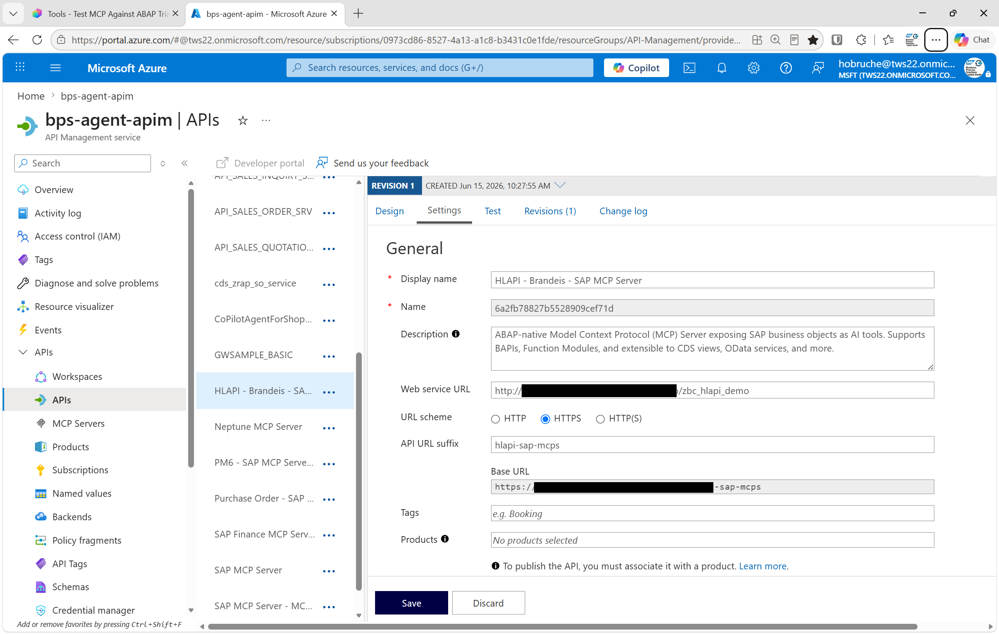
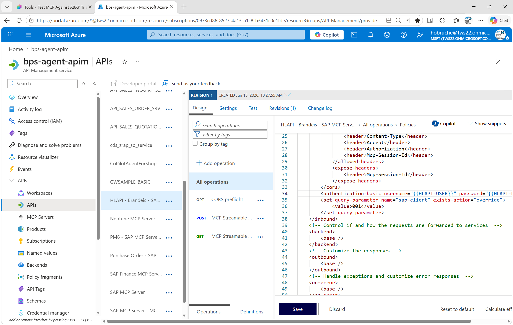
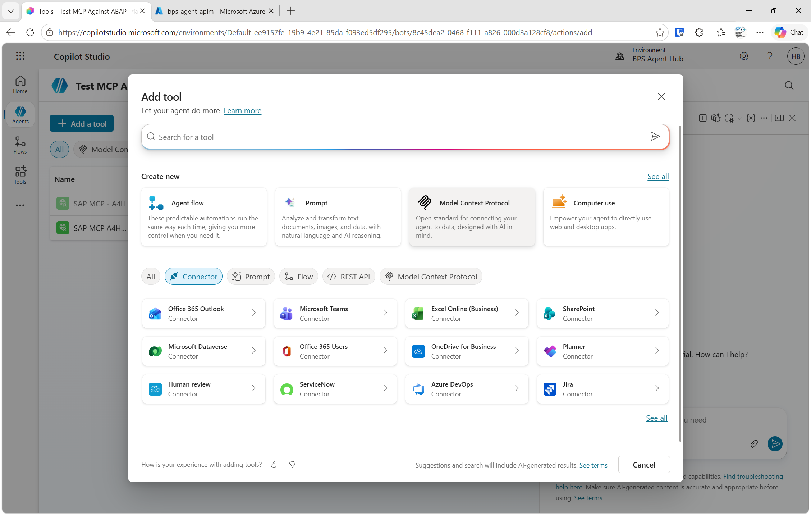
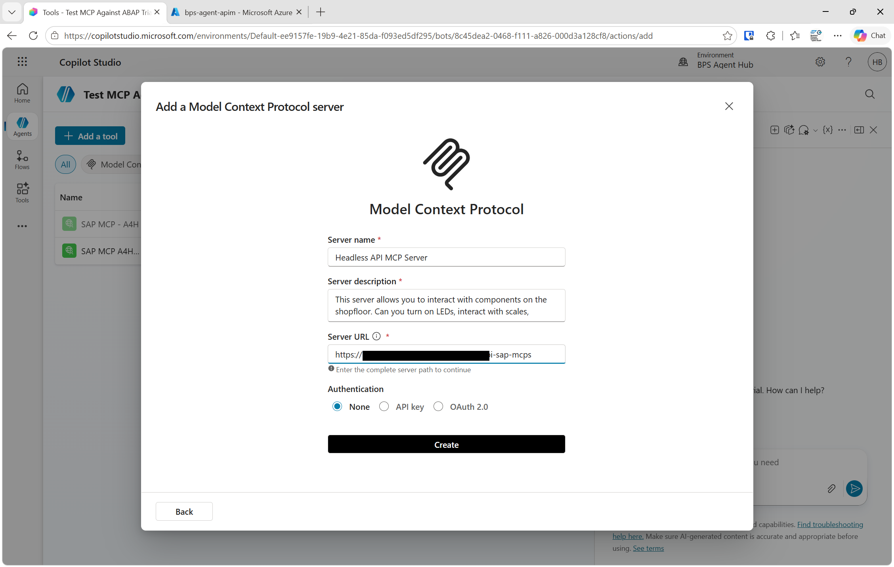
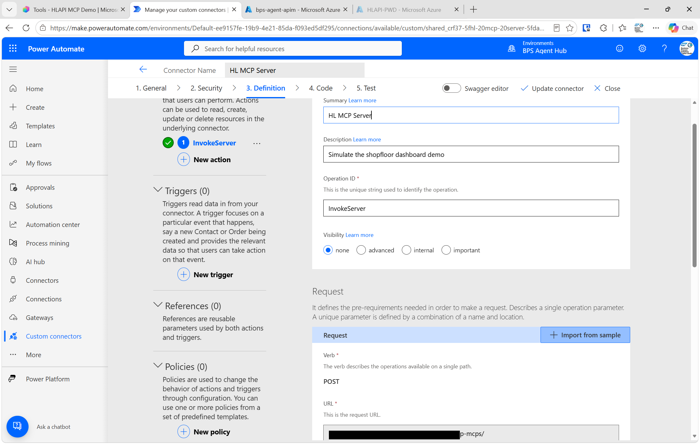
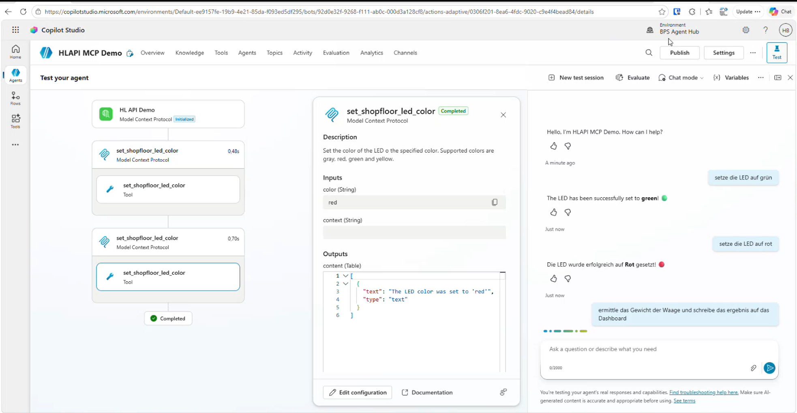
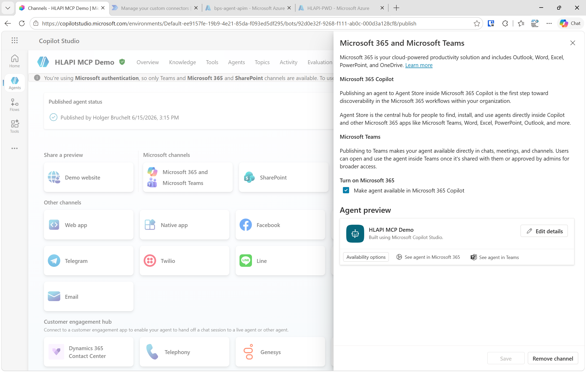
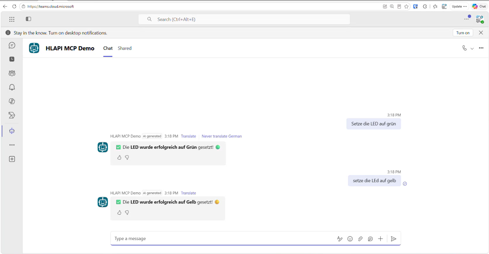

# Connecting Copilot Studio to an SAP ABAP MCP Server via Azure API Management

> **Status:** Draft — based on live demo sessions from 2026-06-15  
> **Authors:** Holger Bruchelt (Microsoft), Jörg Müller (Brandeis)  
> **Screenshots:** Marked with 📸 — add after completing your own walkthrough

---

## Introduction

The **Model Context Protocol (MCP)** is an open standard that allows AI agents to call external tools and APIs in a structured, vendor-neutral way. With the MCP support now available in **Microsoft Copilot Studio** (generally available, not preview), you can connect any AI agent directly to live business data and actions in your SAP ABAP system — without writing custom connectors from scratch.

This guide walks through the end-to-end setup of the following scenario:

- An **MCP Server running natively on SAP ABAP** exposes shopfloor tools (LED control, scale readout, process simulation, dashboard messaging).
- **Azure API Management (APIM)** sits in front of the SAP system as a secure, throttle-capable gateway.
- A **Copilot Studio agent** connects to the MCP endpoint via APIM, discovers tools automatically, and makes them available to users in **Microsoft Teams and Copilot**.

Users can interact in natural language — "Set the LED to green" or "Show me the current weight on the dashboard" — and the agent calls the right SAP tool automatically, with no hardcoded logic in the agent itself.

This pattern is aligned with SAP's own API Policy guidance: always put an API Management layer in front of your SAP system to protect it, apply rate limits, and maintain control over who calls what.

---

## Architecture Overview

```
┌─────────────────────────────────────────────────────────────┐
│                    User Interface Layer                     │
│                                                             │
│   Microsoft Teams      Microsoft Copilot      Mobile App   │
│       (chat / voice)        (@agent mention)               │
└────────────────────────────┬────────────────────────────────┘
                             │
                             ▼
┌─────────────────────────────────────────────────────────────┐
│                   Copilot Studio Agent                      │
│                                                             │
│   • Natural language understanding                          │
│   • Tool selection from MCP tool list                       │
│   • Optional: Instructions, Knowledge, Child Agents         │
└────────────────────────────┬────────────────────────────────┘
                             │  MCP over HTTPS (Streamable HTTP)
                             ▼
┌─────────────────────────────────────────────────────────────┐
│              Power Automate Custom Connector                │
│         (auto-created by Copilot Studio in background)      │
└────────────────────────────┬────────────────────────────────┘
                             │  HTTPS + API Key
                             ▼
┌─────────────────────────────────────────────────────────────┐
│              Azure API Management (APIM)                    │
│                                                             │
│   • HTTPS termination                                       │
│   • Authentication injection (Basic Auth / OAuth)           │
│   • SAP Client parameter injection (sap-client=001)         │
│   • Rate limiting / quota management                        │
│   • Throttling to protect SAP system                        │
└────────────────────────────┬────────────────────────────────┘
                             │  HTTP + Basic Auth
                             ▼
┌─────────────────────────────────────────────────────────────┐
│              SAP ABAP System (SICF Node)                    │
│                                                             │
│   MCP Server (custom ABAP SDK)                              │
│   Exposed tools:                                            │
│     • SetShopfloorLEDColor                                  │
│     • GetWeight                                             │
│     • SetShopfloorMessage                                   │
│     • SetProgress                                           │
│     • SimulateProcess                                       │
└─────────────────────────────────────────────────────────────┘
```

### Why Azure API Management?

Connecting Copilot Studio directly to the SAP ABAP endpoint is technically possible but **not recommended for production**. APIM in the middle gives you:

| Concern | Without APIM | With APIM |
|---|---|---|
| Authentication | Credentials stored in agent | Credentials in APIM policy, not exposed |
| SAP Client | Must be passed by caller | Injected by APIM policy automatically |
| Rate limiting | No protection | Throttle/quota rules protect SAP |
| HTTPS | SAP may only serve HTTP | APIM provides TLS termination |
| Observability | No visibility | APIM logs all calls |
| Multi-tenant use | One agent, one cred | APIM centralises access control |

> **Note:** This is exactly what SAP's own API Policy guidance recommends. This approach is fully aligned with it.

---

## Prerequisites

| Component | Notes |
|---|---|
| SAP ABAP system | With a working MCP server (SICF node). The demo uses the abap-ai ABAP MCP SDK (https://github.com/abap-ai/mcp). |
| Azure subscription | With an API Management instance (any tier) |
| Microsoft 365 tenant | With Copilot Studio access (trial or licensed) |
| Teams license | Required to deploy the agent to Teams |
| Copilot license | Required to use the agent in Microsoft Copilot |
| Network connectivity | APIM must be able to reach the SAP host/port over HTTP/HTTPS |

---

## Step-by-Step Setup

### Step 1 — Verify the SAP ABAP MCP Server

Before configuring the Azure and Microsoft 365 side, confirm the SAP ABAP MCP server is running and reachable.

The MCP server is registered as an **SICF service** in SAP. Its URL follows this pattern:

```
http://<sap-host>:<port>/<area>/<server-name>
```

Example from the demo:
```
http://demo.brandeis.de:50000/demo/zbchlp
```

> The path does **not** end with `/mcp`. The URL above is the full endpoint. No additional suffix is needed.

**To verify:**

1. Open the URL in a browser.
2. Check that the SAP Client (`sap-client`) parameter is accepted as a URL query parameter.
3. Authenticate with the SAP credentials that will be used for the integration (e.g., `DEMO_COPILOT` user).

---

### Step 2 — Configure Azure API Management

Azure API Management acts as the secure reverse proxy between Copilot Studio and the SAP ABAP system.

#### 2a — Import or create an API in APIM

Create a new API in your APIM instance that proxies to your SAP MCP endpoint:

- **Backend URL:** `http://<sap-host>:<port>/<area>/<server-name>` (from Step 1)
- **API URL suffix:** Choose something meaningful, e.g., `hl-mcp-demo` — this becomes part of the APIM-facing URL that Copilot Studio will call.
- **Protocol:** HTTPS on the APIM front end (it will call SAP over HTTP on the back end)

📸 

#### 2b — Add inbound policy to inject authentication and SAP Client

In the APIM API's **Inbound processing policy**, add the following:


```xml
<policies>
  <inbound>
    <base />
    <!-- Inject SAP Client as query parameter -->
    <set-query-parameter name="sap-client" exists-action="override">
      <value>001</value>
    </set-query-parameter>
    <!-- Inject Basic Auth credentials for SAP -->
    <set-header name="Authorization" exists-action="override">
      <value>Basic {{your-base64-encoded-credentials}}</value>
    </set-header>
  </inbound>
  <backend>
    <base />
  </backend>
  <outbound>
    <base />
  </outbound>
</policies>
```

Replace `{{your-base64-encoded-credentials}}` with `Base64(username:password)`.

> **Production note:** In production, replace the hardcoded Basic Auth with **Principal Propagation**: convert the caller's Entra ID (Azure AD) token into an SAP Logon Ticket or SAP OAuth token. This provides true Single Sign-On. See [SAP Principal Propagation with Azure AD](https://learn.microsoft.com/azure/api-management/sap-api) or [this policy](https://github.com/Azure/api-management-policy-snippets/blob/master/examples/Request%20OAuth2%20access%20token%20from%20SAP%20using%20AAD%20JWT%20token.xml) for details.

📸 

#### 2c — Test the APIM endpoint

Use the APIM **Test** console or a tool like Bruno/Postman to send a POST request to your APIM URL. You should see a breakpoint hit on the SAP side (if debugging) and a valid MCP response — not a 401 or 403.

Note the **APIM gateway URL** — you'll need it in Step 4. It looks like:

```
https://<your-apim-name>.azure-api.net/<api-suffix>
```

---

### Step 3 — Create a Copilot Studio Agent

1. Navigate to [Copilot Studio](https://copilotstudio.microsoft.com) and sign in.
2. Click **Create** → **New agent**.
3. Give the agent a name, e.g., **"HLAPI MCP Demo"**.
4. Click **Create**.

Once the agent is created, you land on the agent overview. Configure these settings:

- **Allow Ungrounded Responses:** Turn **off** (the agent should only answer from its tools and knowledge, not general LLM knowledge — for a demo or tightly scoped industrial agent)
- **Use Information from the Web:** Turn **off** (optional — keeps responses strictly grounded in SAP data)

---

### Step 4 — Add the MCP Server as a Tool

This is the core step that connects the agent to your SAP ABAP system.

1. In the agent, click **Tools** in the top navigation (next to Overview, Knowledge, Channels).
2. Click **Add a tool** → choose **MCP Server** (also labelled "Headless MCP Server").

📸 

3. Fill in the tool configuration:

| Field | Value |
|---|---|
| **Name** | `Headless API MCP Server` (or any descriptive name) |
| **Description** | What this MCP server does, e.g., `Simulates a shopfloor dashboard — controls LED status, reads scale weight, updates progress and messages.` The agent uses this description to decide when to invoke the server. |
| **Server URL** | Your APIM gateway URL from Step 2c, **without** a trailing `/mcp`. Example: `https://my-apim.azure-api.net/hl-mcp-demo` |
| **Authentication** | None (APIM handles all authentication via the inbound policy) |

📸 

4. Click **Connect** (or **Next** / **Save** depending on the UI version).

> **What happens in the background:** Copilot Studio calls your APIM endpoint to fetch the MCP tool list (the `tools/list` method). It creates a **Custom Connector** in Power Automate automatically. You can verify this by going to Power Apps / Power Automate → Custom Connectors — you'll see a new connector named after your agent's MCP server.

📸 

5. Back in Copilot Studio, click the MCP server entry → click **Refresh** to load the tool list. You should now see all tools exposed by the SAP ABAP MCP server:

📸 

#### Selecting which tools to expose

You don't have to expose all tools. The MCP server may offer many tools, but you can configure the agent to only use a subset:

- **All tools:** Enable the "Allow all" toggle — the agent can use every tool the MCP server provides.
- **Selective:** Enable only the tools relevant to this agent's use case.

> **Why this matters:** Fewer active tools → faster tool selection by the LLM, more focused agent behaviour. If your SAP system exposes 100 tools but this agent only needs 5, enabling only those 5 improves response quality and speed.


#### Adding instructions to individual tools

Each tool has a **Description** field that the LLM uses for tool selection. You can customise these descriptions within the agent without modifying the SAP MCP server:

- Click a tool → edit its description.
- Example: Append "Call this tool first if the user asks about any LED or status light" to guide routing.

---

### Step 5 — Test in Copilot Studio

Use the **Test** panel on the right side of Copilot Studio to validate the integration before publishing.

Try these prompts (in German or English, depending on your preference — the LLM handles both):

| Prompt | Expected tool call |
|---|---|
| "Setze die LED auf Grün" | `SetShopfloorLEDColor(color=green)` |
| "Set the LED to red" | `SetShopfloorLEDColor(color=red)` |
| "Ermittle das Gewicht der Waage und schreibe es auf das Dashboard" | `GetWeight()` then `SetShopfloorMessage(...)` |
| "Setze den Fortschritt auf 65%" | `SetProgress(value=65)` |



If the tool call works in the test panel, the tool invocation is visible under the response (the agent shows which tool it called and with what parameters).

---

### Step 6 — Publish to Microsoft Teams and Copilot

Once testing is successful, deploy the agent to your users.

1. In the agent, click **Channels** in the top navigation.
2. Select **Microsoft Teams and Copilot**.
3. Optionally customise the app icon, short description, and long description.
4. Click **Publish** → confirm.

📸 

#### Add the agent in Teams (as the user)

After publishing, users need to add the agent to their Teams client once:

1. Open **Microsoft Teams**.
2. Click the **Apps** or **Copilot** section in the left rail.
3. Search for your agent by name (e.g., "HLAPI MCP Demo").
4. Click **Add**.

The agent is now available as a **chat bot** in Teams. Users can:

- Open a direct chat with the agent and type prompts.
- Use the **microphone** button (bottom left in the chat window) for voice input.
- In the **Copilot app**, type `@HLAPI MCP Demo` in a new chat to invoke the agent inline alongside other agents.

📸 

#### Using the agent via mobile

The same agent works on the Teams mobile app:

1. Open Teams on your phone.
2. Go to **Chats** → find the agent.
3. Type or speak your command.

---

### Step 7 — (Optional) Add to Copilot Multi-Agent Chat

In **Microsoft Copilot** (the full Copilot app), you can invoke the SAP agent alongside other agents in a single conversation using the `@` mention:

1. Open Copilot.
2. Start a new chat.
3. Type `@` and the beginning of your agent's name → select it from the list.
4. Continue the prompt: `@HLAPI MCP Demo setze die LED auf orange`.

This enables **multi-agent scenarios**: for example, in one message you can ask `@Salesforce` for the last customer message, then `@HLAPI MCP Demo` to update the shopfloor status accordingly.


---

## Production Considerations

### Replace Basic Auth with Principal Propagation

The demo uses hardcoded Basic Auth credentials in the APIM policy. For production:

1. The caller (Copilot Studio / Power Automate) passes the user's **Entra ID (Azure AD) access token** to APIM.
2. APIM exchanges it for an **SAP Logon Ticket** or **SAP OAuth token** using the SAP Principal Propagation pattern.
3. The user authenticates to SAP as themselves, not as a shared service account.
4. This provides true **Single Sign-On** and full SAP authorisation granularity.

See: [SAP Principal Propagation with Azure API Management](https://learn.microsoft.com/azure/api-management/sap-api)

### Rate Limiting and Quota Management

Add APIM policies to protect the SAP system from excessive AI-driven requests:

```xml
<rate-limit calls="60" renewal-period="60" />
<quota calls="1000" renewal-period="86400" />
```

Adjust values based on your SAP system's capacity.

### Tool Refresh

When a developer adds a new tool to the SAP ABAP MCP server:

- Copilot Studio **auto-detects** the new tool on the next agent conversation start.
- If you want to force an immediate refresh: go to the agent → Tools → click the **Refresh** icon next to the MCP server description.
- No republishing of the agent is required.

### Tool Scoping

As your MCP server grows, keep agents focused:

- Create **separate agents** for separate use cases (shopfloor agent, procurement agent, etc.).
- Each agent enables only the tools relevant to its purpose.
- This improves LLM accuracy (fewer tools to choose from) and limits the blast radius if an agent misbehaves.

### Licensing Summary

| Capability | License required |
|---|---|
| Build and test the agent in Copilot Studio | Copilot Studio (trial available) |
| Deploy to Microsoft Teams | Microsoft Teams + Copilot Studio |
| Use the agent via Microsoft Copilot | Microsoft 365 Copilot license |
| Azure API Management | Azure subscription (any APIM tier) |

---

## Troubleshooting

| Symptom | Likely cause | Fix |
|---|---|---|
| 403 / "Request blocked by UCON" | SAP UCON (Unified Connectivity) is filtering the inbound call origin | Whitelist the APIM IP range in SAP UCON transaction; or adjust the UCON profile |
| Tools list is empty after connecting | Wrong URL (e.g., extra `/mcp` suffix) | Remove `/mcp` from the end of the Server URL in the Copilot Studio tool config |
| 401 Unauthorized from APIM | Credentials not saved or wrong base64 encoding | Re-enter credentials in the APIM inbound policy; re-test from the APIM Test console |
| Custom Connector not created | Copilot Studio timed out during the initial connect | Delete the MCP tool entry and re-add it; check the Custom Connectors list in Power Automate |
| Agent responds but doesn't call the tool | Tool description is too vague | Improve the tool description in the Copilot Studio tool config to be more specific |
| Port missing from APIM backend URL | Copy-pasted the SAP URL without the port | Add `:50000` (or your SAP port) explicitly in the APIM backend URL |

---

## Summary: The 8-Step Checklist

- [ ] **1.** SAP ABAP MCP server running and reachable via browser (SICF node)
- [ ] **2.** Azure API Management API created with SAP backend URL
- [ ] **3.** APIM inbound policy injects `sap-client` and `Authorization` header
- [ ] **4.** APIM test returns a valid MCP response
- [ ] **5.** Copilot Studio agent created with appropriate settings
- [ ] **6.** MCP Server added as a tool in the agent using the APIM HTTPS URL
- [ ] **7.** Tools appear in the agent and respond correctly in the test panel
- [ ] **8.** Agent published to Teams; users can chat and use voice input

---

## Resources

- [Copilot Studio — MCP support documentation](https://learn.microsoft.com/microsoft-copilot-studio/agent-extend-action-mcp)
- [Azure API Management — SAP integration](https://learn.microsoft.com/azure/api-management/sap-api)
- [ABAP MCP SDK — GitHub (Jörg Müller / Brandeis)](https://github.com/) ← *Add the correct GitHub URL here*
- [HLAPI Demo repository (Node-RED + Dashboard)](https://github.com/) ← *Add the correct GitHub URL here*
- SAP ABAP Conference session (ABAP Conf 2026-06-22, Mannheim)
